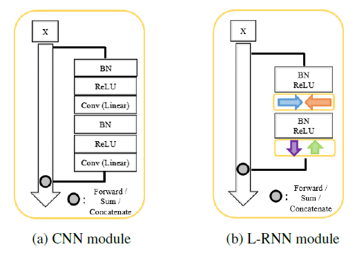
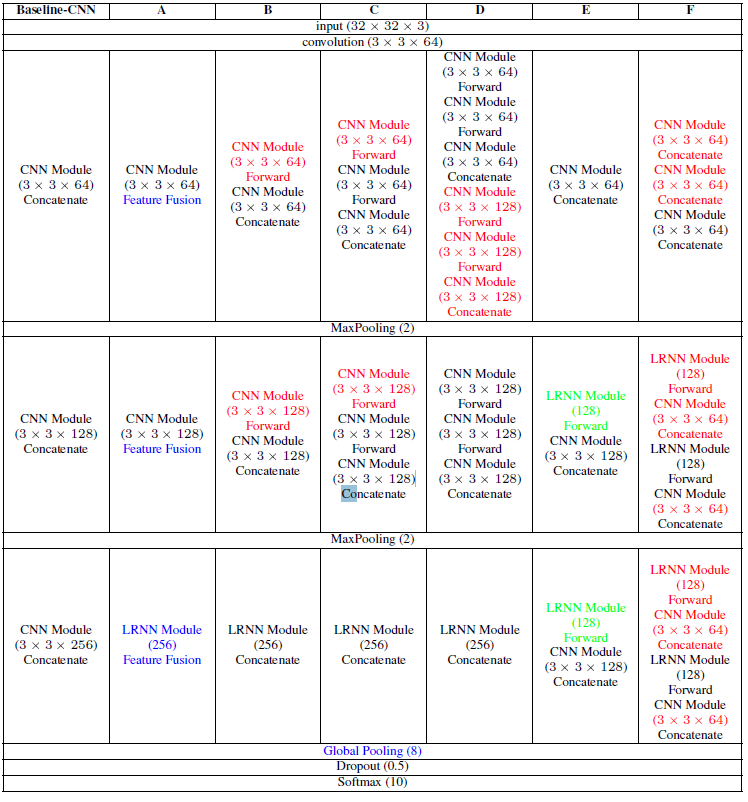

# Layer-Recurrent-Neural-Network
Layer Recurrent Neural Network Implementation with Tensorflow

Layer Recurrent Neural Network is expanded version of ReNet and SegNet.

It combines Convolutional Neural Network (CNN) and Recurrent Neural Network (RNN).

It can consider directional relationship in activation map. 

Thus it can expected to capture spatial context in activation maps.

Spatial Recurrent Module is implemented, and it makes activation maps with recurrent neural network with various direction.
(left --> right, right --> left, top --> bottom, bottom --> top).

The result activation maps can be concatenated or summed. 

Model Description

LRNN_module

Model_topologies

